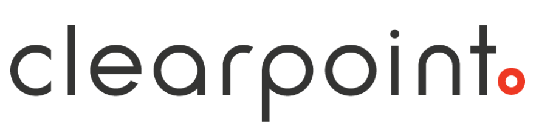

<a id="readme-top"></a>

<!-- PROJECT LOGO -->
<br />
<div align="center">
  <a href="https://github.com/aronblum/developer-assessment">
    
  </a>

  <h3 align="center">Developer Assessment - Front End</h3>
</div>

<!-- ABOUT -->

## A bit about the project

The Front End is built using [React](https://react.dev/) and [TypeScript](https://www.typescriptlang.org/). It also uses [Vite](https://vitejs.dev/) as it's build tool, and [Vitest](https://vitest.dev/) for testing.

<p align="right">(<a href="#readme-top">back to top</a>)</p>

<!-- GETTING STARTED -->

## Getting Started

To get a local copy up and running follow these simple example steps:

### Setup

1. Clone the repo (if you haven't already)
   ```sh
   git clone https://github.com/aronblum/developer-assessment.git
   ```
2. Install NPM packages
   ```sh
   npm install
   ```
3. Start the application
   ```sh
   npm start
   ```

<p align="right">(<a href="#readme-top">back to top</a>)</p>

<!-- USAGE EXAMPLES -->

## Usage

If everything has worked correctly with the setup, you should see the following:


Once you have completed the setup steps listed in the [Back End README](../server/README.md), you should be able to do the following via the UI:

- Create a new Todo
- View a list of Todo items (including the abililty to show/hide completed Todos)
- Mark a Todo as complete/incomplete

<p align="right">(<a href="#readme-top">back to top</a>)</p>
