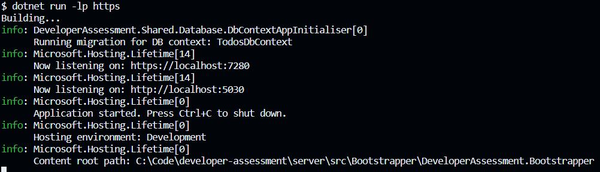

<a id="readme-top"></a>

<!-- PROJECT LOGO -->
<br />
<div align="center">
  <a href="https://github.com/aronblum/developer-assessment">
    
  </a>

  <h3 align="center">Developer Assessment - Back End</h3>
</div>

<!-- ABOUT -->

## A bit about the project

The Back End is built using .NET 8 and is structured as a [Modular Monolith](https://www.thoughtworks.com/en-us/insights/blog/microservices/modular-monolith-better-way-build-software).

Each of the [Modules](./src/Modules) in the solution are intended to represent isolated domains.

The [Bootstrapper](./src/Bootstrapper) is the entry point for getting everything to work as a single deployable.

As the project grows, this structure enables the flexibility to eventually move to a [Microservices](https://en.wikipedia.org/wiki/Microservices) architecture. In the interim, through feature-flagging the solution could even be scaled horizontally per module if desired.

<p align="right">(<a href="#readme-top">back to top</a>)</p>

<!-- GETTING STARTED -->

## Getting Started

To get a local copy up and running follow these steps:

### Setup

1. Clone the repo (if you haven't already)
   ```sh
   git clone https://github.com/aronblum/developer-assessment.git
   ```
2. Setup the [Postgres Docker Container](./docker-compose.yaml)
   ```sh
   docker-compose up -d
   ```
3. Start the application while targetting the [Bootstrapper Project](./src/Bootstrapper/DeveloperAssessment.Bootstrapper)
   ```sh
   dotnet run -lp https
   ```

<p align="right">(<a href="#readme-top">back to top</a>)</p>

<!-- USAGE EXAMPLES -->

## Usage

If everything has worked correctly with the setup, you should see the following:



Once you have completed the setup steps listed in the [Front End README](../client/README.md), you should be able to do the following via the UI:

- Create a new Todo
- View a list of Todo items (including the abililty to show/hide completed Todos)
- Mark a Todo as complete/incomplete

<p align="right">(<a href="#readme-top">back to top</a>)</p>
